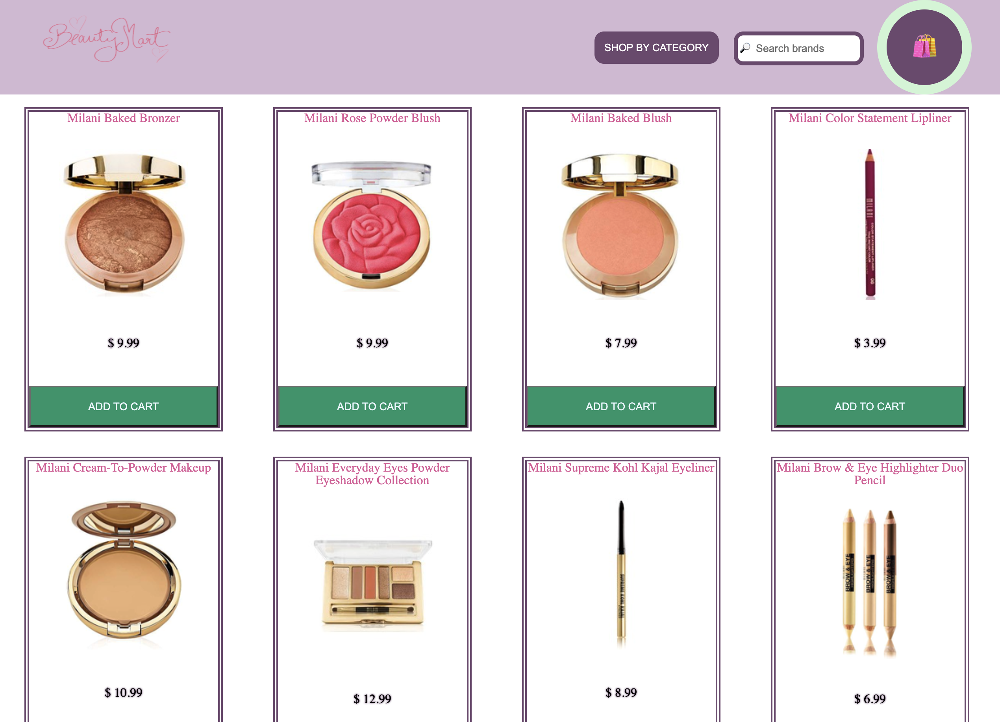
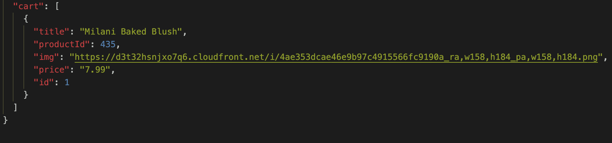

# BEAUTY MART - A Single Page Application in JS

## Demo

Here is a working live demo:
[Youtube](https://youtu.be/rHFJRz0TAOE)

## About
This SPA provides Online Shopping Experience, a user can search for the items they are looking for and can also shop for them.

## Installation

This application uses Free PUBLIC API for makeup products and also uses JSON Server to store reviews and cart items

### Install JSON Server

```npm install -g json-server```

### Start JSON Server

```json-server --watch db.json```

## Resources 

### Free Public API
[API LINK](https://makeup-api.herokuapp.com/api/v1/products.json)

### REST API
#### To GET OR POST Reviews
http://localhost:3000/reviews
#### To POST, GET OR DELETE from cart
http://localhost:3000/cart

## FETCH REQUESTS USED
* `GET`,
* `POST`,
* `DELETE`

## How it looks when the items get added to cart in JSON SERVER 



## Roadmap
* Add quanities to the cart 
* Add one checkout for all items instead of only individual items
* Add likes to the products and store them in JSON server

## Contributing

Contributions are what make the open source community such an amazing place to be learn, inspire, and create. Any contributions you make are greatly appreciated.

## Contact

Email- Salonimehta2127@gmail.com 

Project Link: https://github.com/salonimehta27/Beauty-Mart-JS-Project
